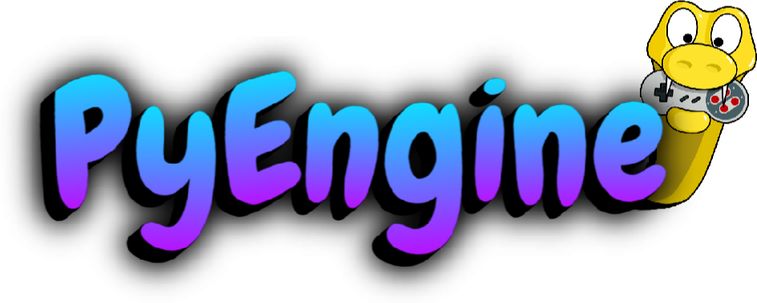

# WHAT IS PYENGINE 

**PyEngine is a work is progress game engine that exports to web/linux/windows/mac os/android/ios**

1.So PyEngine supports a variety of platforms so which language do you write in it python, and soon 
 to be a visual scripting solution 

 2.When is PyEngine going to release 
  PyEngine will most likely release a alpha build in 3 months from now and this is written in 3/23/2024 

  3.Is PyEngine open source 
   YES! PyEngine is open source it has a MIT License 

  4.What rending library does PyEngine use 
   PyEngine uses SDL (Simple DirectMedia Layer) but will most likely have support for OpenGL but not on release 

  5.What is PyEngine written in 
   PyEngine is written in python 

   6.Does PyEngine or **WILL** PyEngine cost money 
    No PyEngine will be a open source project that I work on in my free time  
    so no it will not be paid but you will be able to donate 
